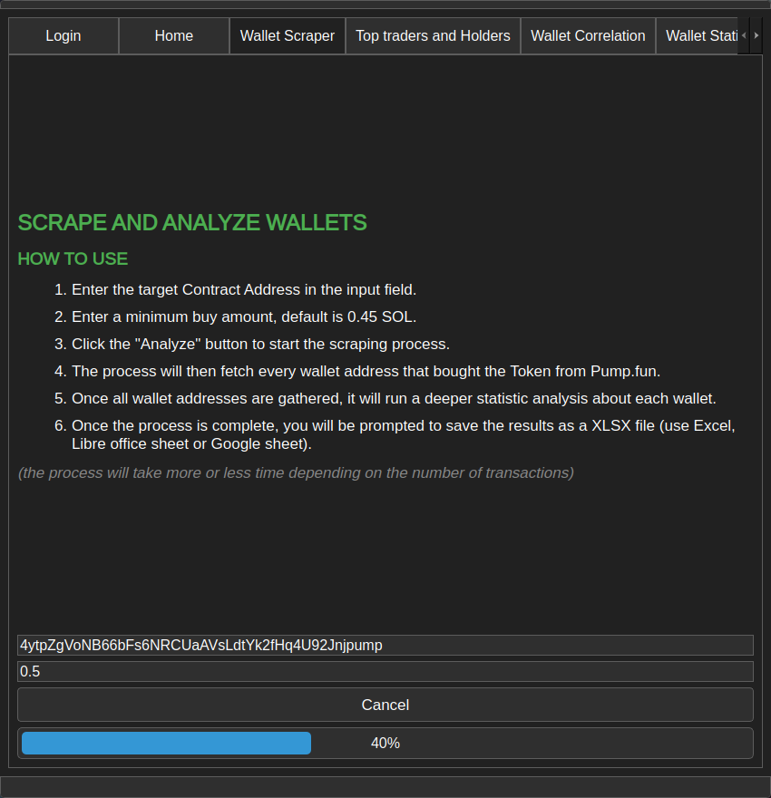
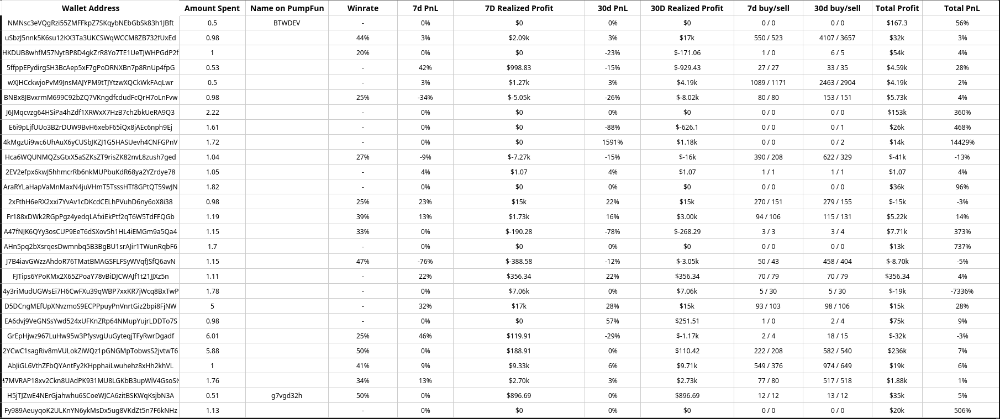
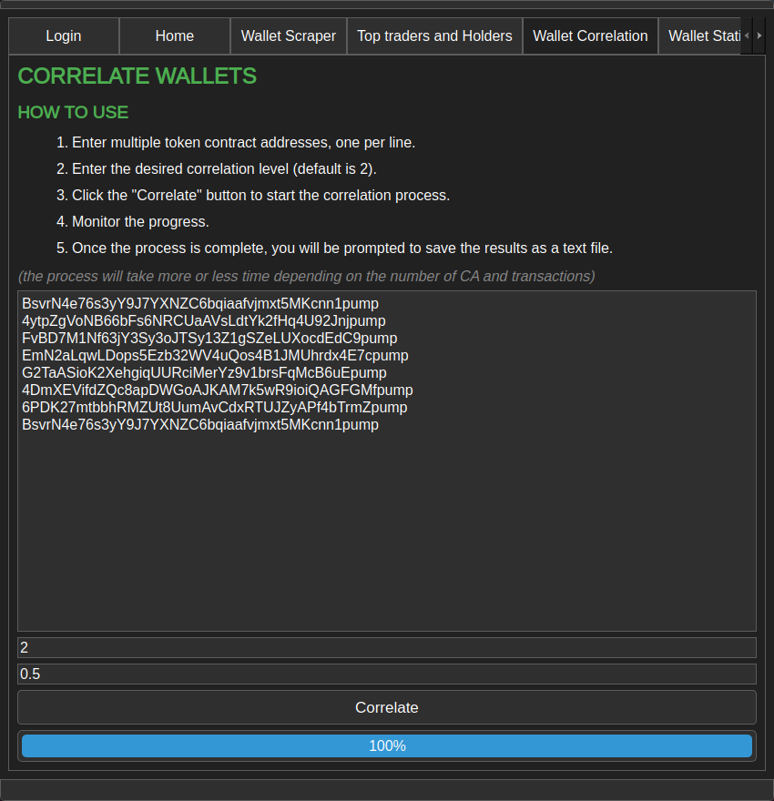
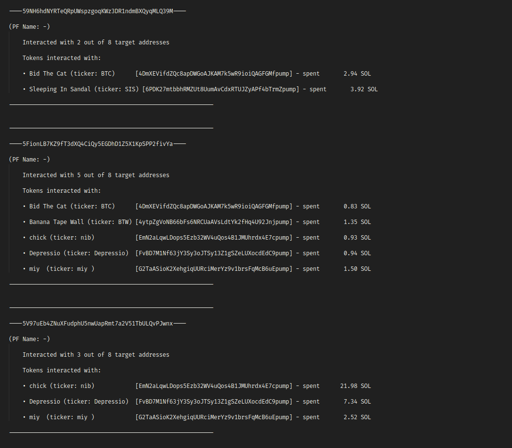
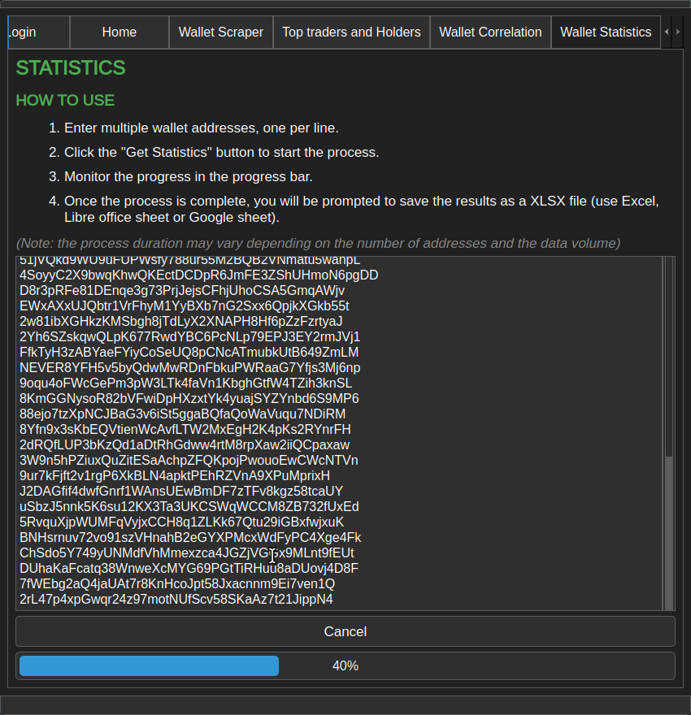
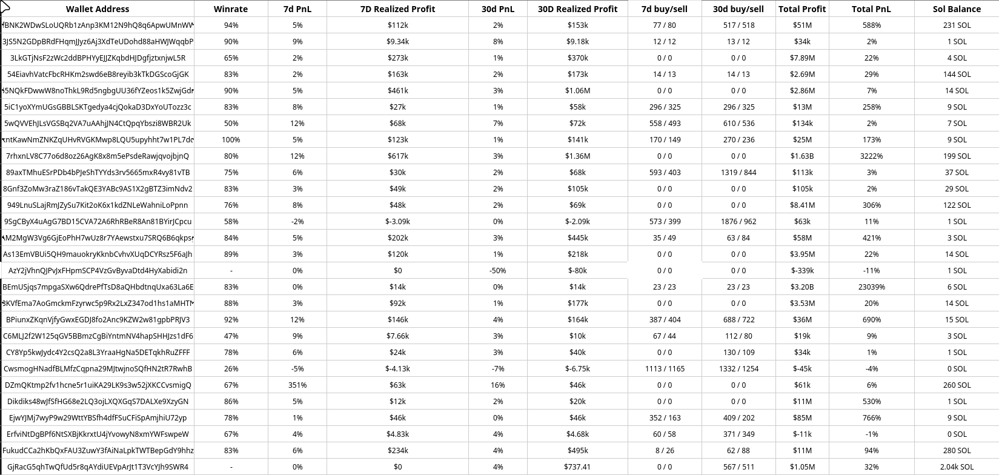
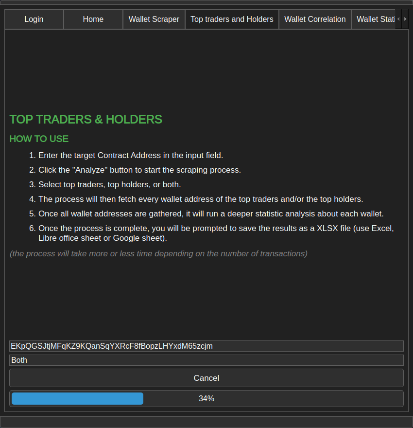
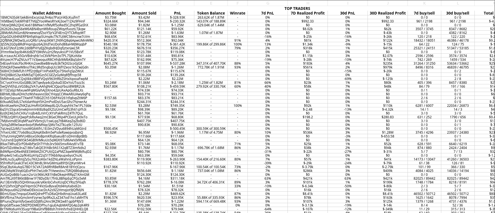

# Wallet Nexus

Welcome to Wallet Nexus, a comprehensive set of tools designed to help you analyze wallet interactions and performance on the Solana blockchain. Whether you’re tracking wallet statistics or discovering the top traders, Wallet Nexus offers a powerful way to scrape and analyze data with precision.

---

## Features

Wallet Nexus includes the following powerful tools to help you gather and analyze wallet data:

### 1. Pump.fun Wallet Scraper

Retrieve all the wallets that have interacted with a contract address (CA) on Pump.fun, and access comprehensive statistics such as:

- Amount bought
- Winrate
- Profit & Loss (PnL)
- Realized profit
- SOL balance

---

### 2. Pump.fun Wallet Correlation

Find wallets that have interacted with two or more contract addresses (CAs) on Pump.fun, along with detailed statistics:

- Amount bought
- Winrate
- PnL
- Realized profit
- SOL balance

---

### 3. Wallet Statistics

Analyze multiple wallets with deep insights into their:

- Winrate
- PnL
- SOL balance
- and more...

---

### 4. Top Traders & Top Holders

Gather detailed data about the top 100 traders and top 20 holders for any Solana token. The tool provides detailed statistics, including:

- Amount bought
- Winrate
- PnL
- Realized profit
- SOL balance

---

## Subscription Plans

Wallet Nexus is a closed-source program, available through a subscription. You can choose between the following plans:

| **Plan**        | **Price (SOL)** |
|-----------------|-----------------|
| 1 Month         | 1 SOL           |
| 3 Months        | 3 SOL           |
| 6 Months        | 5 SOL           |

---

## Getting Started

To get access to Wallet Nexus, you need to subscribe to one of the plans above. After payment, you will be able to login, download and use the program with your Solana public address and password.

## License

This project is closed-source and requires a paid subscription for use. Redistribution or reverse engineering of the code is strictly prohibited.

## Contact

For any inquiries or support, feel free to reach out via:

- Website: Https://WalletNexus.net
- Email: walletnexus@mail.com
- Twitter: https://x.com/WalletNexus
- Telegram: https://t.me/WalletNexus
